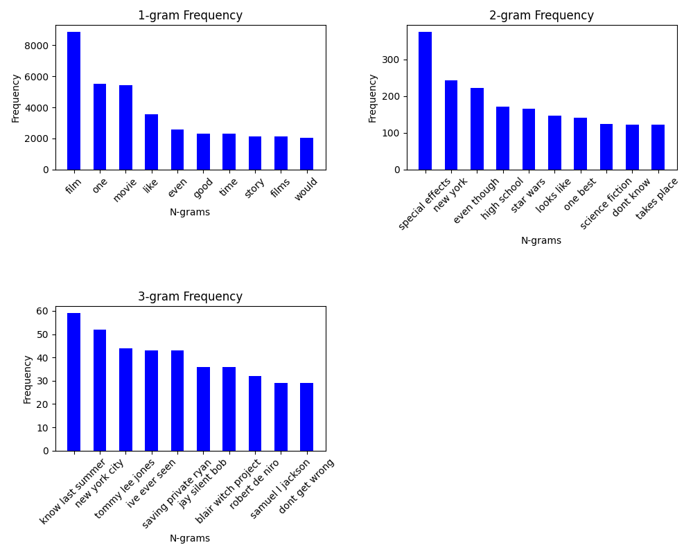
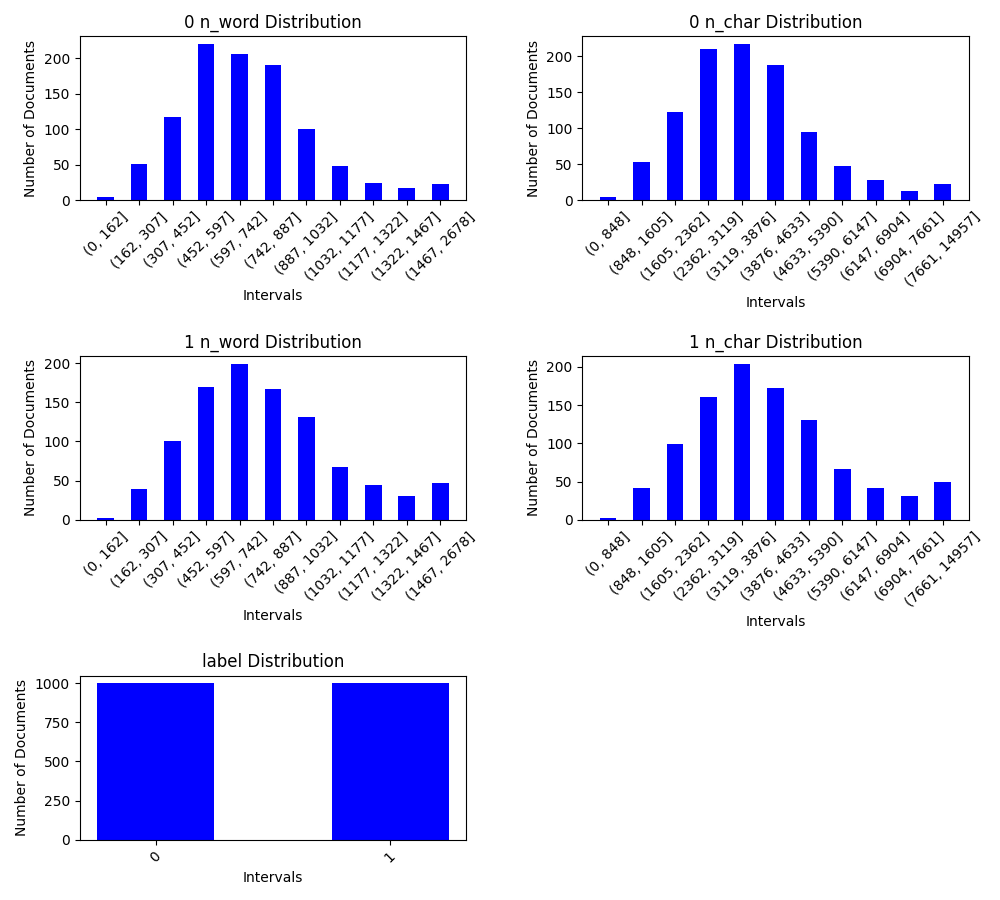

# ETA (Exploratory Text Analysis)

A tool for applying Exploratory Data Analysis on Text data with a few lines of code.


## Installation

Clone this repository to your local machine:

```bash
git clone https://github.com/fatihsati/ETA.git
cd ETA
```

Make Sure you set the Pythonpath to the root directory of the project.

```bash
export PYTHONPATH=/path/to/ETA
```

Be sure you have the dependencies
```
pip install -r requirements.txt
```
Download the stopwords for nltk, if you haven't already
```
import nltk
nltk.download('stopwords')
```

## Supported Features

1. analyzer
    1. Analyzer
    2. LabelledAnalyzer

> ***It is planned to expand this list in the future***

## Usage/Examples

### CLI
You may run the ETA features on your data using cli tools in the terminal. 

**Example Usage:**
```
python analyzer_cli.py --input_file input.csv --text_column=text --output_path path/to/folder 
```

**For more information about arguments:**
```
python analyzer_cli.py --help
```

### Code
You can also import features into your own code for more specialized usage.

```Python
from analyzer import Analyzer

analyzer = Analyzer()
analyzer.read_csv('movie_reviews.csv', text_column='review')
analyzer.generate_distribution_plots(show=False, save=True, output_path='distribution_plot')
analyzer.generate_ngram_plots(show=False, save=True, output_path='ngram_plot')
analyzer.generate_word_cloud(output_path='word_cloud.png')
analyzer.to_json(filename='stats.json')
```

```Python
from analyzer import LabelledAnalyzer

analyzer = LabelledAnalyzer()
analyzer.read_csv('./movie_reviews.csv', text_column='review', label_column='sentiment')
analyzer.generate_distribution_plots(show=False, save=True, output_path='distribution_plot')
analyzer.generate_ngram_plots(show=False, save=True, output_path='ngram_plot')
analyzer.generate_word_cloud(output_path='word_cloud')
analyzer.to_json(folder_name='stats')
```

## Output Examples
**n-gram plots:**


**word-char distribution plots**


## Analysis Fields
- stopwords
- n_nonalpha
- ngram_nrange
- ngram_firstk
- n_disrtibution_bins
- stopword_list
- document_count
- char_number
    - min
    - mean
    - max
    - sum
- longest_doc_lengths
- shortest_doc_lengths
- word_number
    - min
    - mean
    - max
    - sum
- longest_doc_lengths
- shortest_doc_lengths
- non_alpha_chars
    - 10_most_common_with_freq
    - total_count
- ngram_dict
    - 1
    - 2
    - 3


